# Soft Skills for Software Engineers

How to balance hard skills and soft skills to accelerate your engineering career.

---

# Diligent

> Connecting Risk, Compliance, Audit & ESG for Stronger Governance.

<ol style="font-size: xx-large">
  <li>Deploy SaaS enterprise software applications that affects > 15k organizations worldwide.</li>
  <li>Build with a next generation technical stack: AWS, Serverless, Event-Driven Architecture.</li>
  <li>Work with highly motived team members along with inspirational, servant-based leaders.</li>
  <li>Stability of a big company with the energy and growth prospects of a start-up.</li>
</ol>

---

# We're Hiring!

https://www.diligent.com/company/careers/

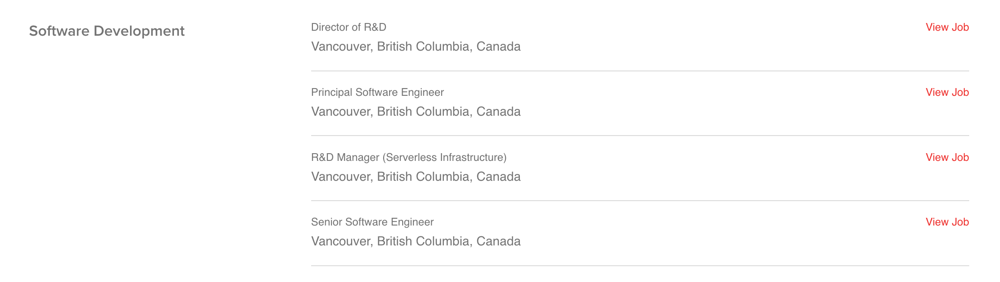

Just remember: Greg Gzik recommended you 😉

---

## Look at this Reddit thread 👀

---

## The Truth about the Job Market

- Great "hard skills" get you a great job
- Great "soft skills" get you great opportunities
- The combination of both gets you a successful engineering career

---

## Who am I?

Greg Gzik, Senior Software Engineer at Diligent

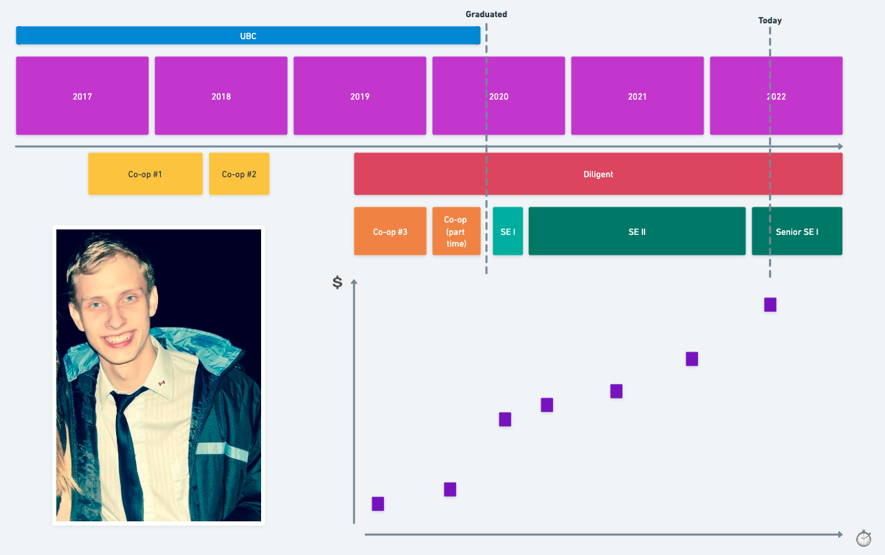

---

# My Special Power

<iframe width="973" height="600" src="https://www.youtube.com/embed/H4lxP8SUxN8" title="YouTube video player" frameborder="0" allow="accelerometer; autoplay; clipboard-write; encrypted-media; gyroscope; picture-in-picture" allowfullscreen></iframe>

---

# Rule 1: Understand Yourself

---

# Personality Tests

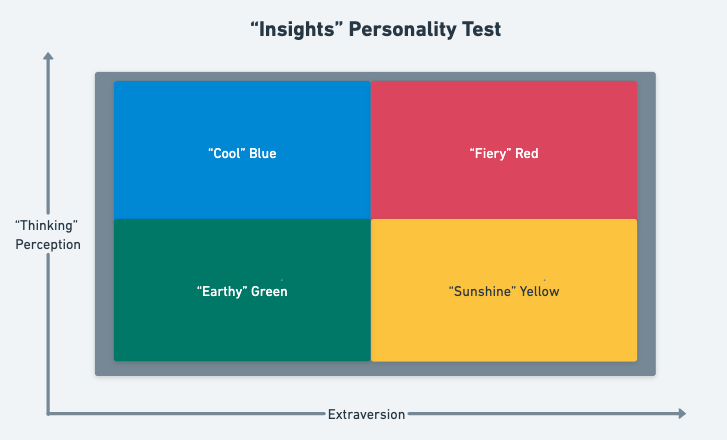

 Myers Briggers image above creditted to <a href="https://commons.wikimedia.org/wiki/File:MyersBriggsTypes.png">Wikipedia user Jake Beech</a>.

---

# The Reviews are In!

"Pretty much meaningless" - Rose Eveleth, Science Writer

"One of the worst personality tests in existence" - Angus Chen, Journalist for Scientific American

"Most personality psychologists regard the Myers Briggs as little more than an elaborate fortune cookie..." - Robert Hogan, Pyscologist specializing in personality tests

---

# The Big 5 Personality Traits

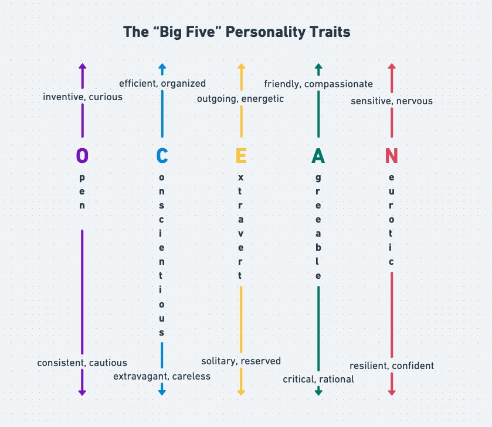

Openness, Conscientiousness, Extraversion, Agreeableness, Neuroticism

---

# Personality Fingerprints

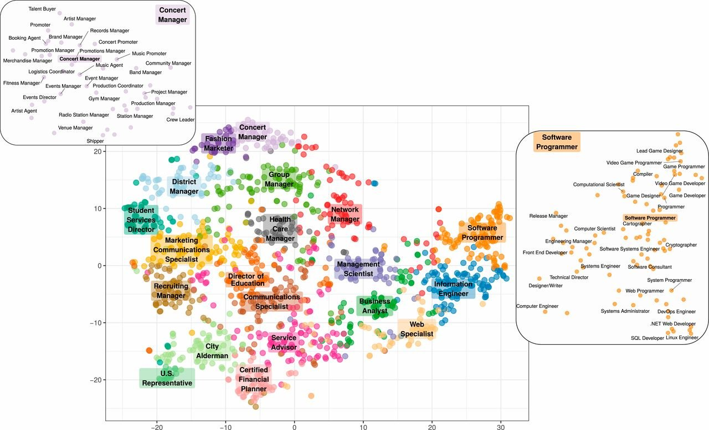

View the <a href="https://www.rizoiu.eu/documents/research/resources/Vocation_Map_Interactive.html" target="_blank">interactive map</a>.

Kern, M. L., McCarthy, P. X., Chakrabarty, D., &amp; Rizoiu, M.-A. (2019). Social media-predicted personality traits and values can help match people to their ideal jobs. Proceedings of the National Academy of Sciences, 116(52), 26459–26464. https://doi.org/10.1073/pnas.1917942116

---

# Balance your Personality

**Are you highly agreeable?**

Seek advice from a disagreeable colleague before moving forward on a design.

**Are you introverted?**

Ask your extraverted boss for help pulling the team together to tackle a challenge.

**Do you sometimes forget little details?**

Pair with a conscientious person during a code review to know what to look out for.

---

# Rule 2: Choose your Company Carefully

---

# Job Description

Hiring - Full Stack Developer 😀 🤪 🔥 🥳

Requirements:

- Frontend Engineering
- Backend Engineering
- Mobile Development
- Machine Learning Expertise
- Cloud Infrastructure
- Background in Information Security
- 10+ Years of Swift
- ...

---

# Hiring - Software Dev in Test

Our mission is to make actionable health information accessible to people everywhere in the world at the time it matters, enabling early detection and intervention of disease, and empowering individuals with information to live the lives they want to live.

<ul style="font-size: xx-large">
  <li>Bachelor's degree in Computer Science, Computer Engineering or similar technical field</li>
  <li>3+ years of industry experience</li>
  <li>Must be hands-on with coding/testing C#/Java/C++ programming languages</li>
</ul>

---

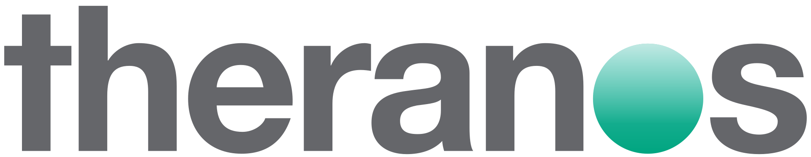
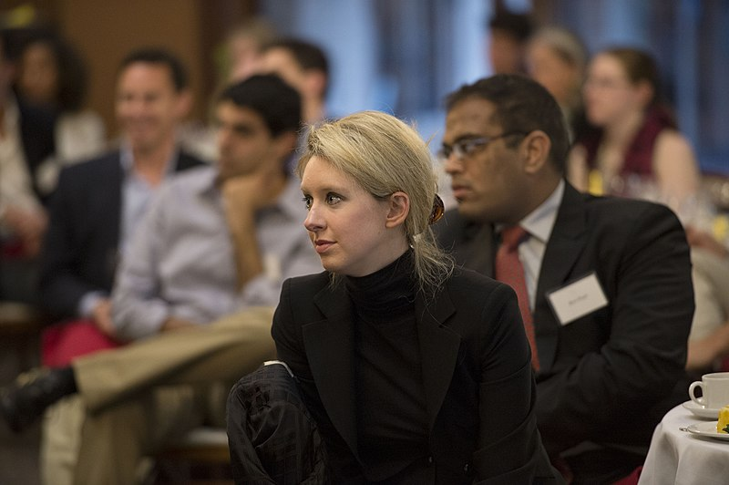

---

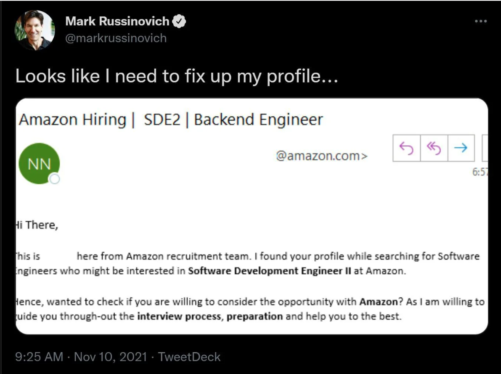

---

# Choosing a Company is Hard

But really, really important.

How do you find the "right" one?

---

# Three Types of Companies

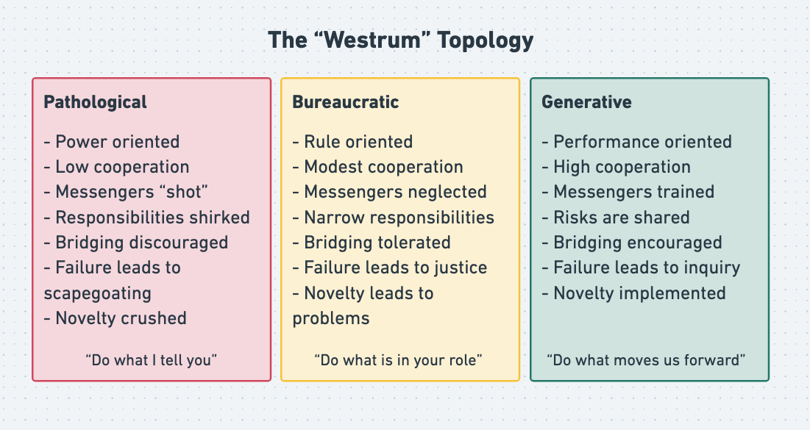

Adapted from <a href="https://cloud.google.com/architecture/devops/devops-culture-westrum-organizational-culture">DevOps Culture: Westrum Organization Culture</a> in Google's Cloud Architecture Center.

---

# Discover the Category

<ul style="font-size: xx-large">
  <li>Find reviews on Glassdoor</li>
  <li>Reach out on LinkedIn and buy a current employee coffee</li>
  <li>Interview: Do you have any questions for me? Yes you do!</li>
</ul>

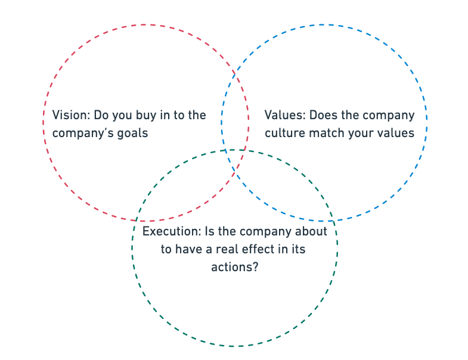

---

# No Company is Perfect for all

Think deliberately about the kind of work **you** want to do.

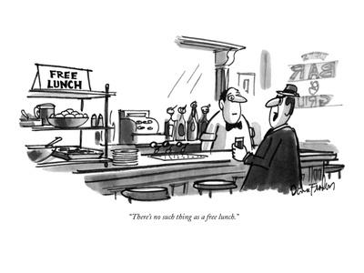

No Free Lunch Cartoon from the <a href="https://www.art.com/products/p15062983355-sa-i6838808/dana-fradon-there-s-no-such-thing-as-a-free-lunch-new-yorker-cartoon.htm">New Yorker magazine</a>.

---

# Motivation Break

> Follow Your Passion - Every School Guidance Counselor

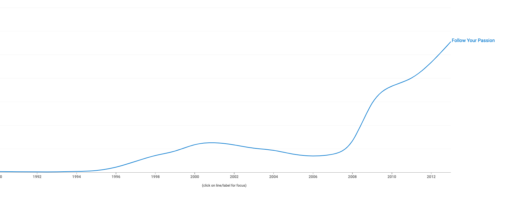

<a href="https://books.google.com/ngrams/graph?content=Follow+Your+Passion&year_start=1990&year_end=2013&corpus=26&smoothing=2">Google NGram Search</a>, idea from <a href="https://80000hours.org/articles/dont-follow-your-passion/">Benjamin Todd at 80000 hours</a>

---

# Define: Passion

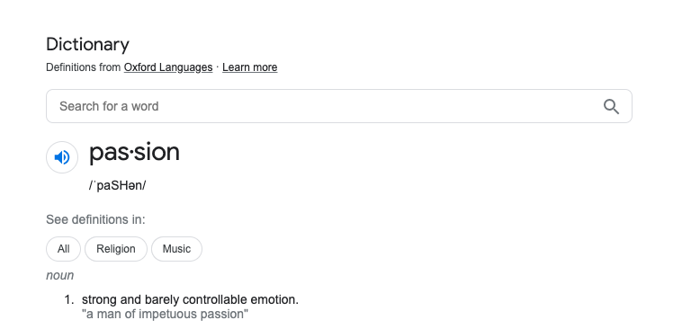

---

# Quit Today if you are not Passionate about...

- Debugging test cases
- Production outages
- Sprint planning meetings
- SRED notes
- Product deadlines
- Blockers from team dependencies

If you aren't eating code for breakfast, what are you even doing here?

---

# Rule 3: Hone a Craftsman Mindset

---

# So Good They Can't Ignore You

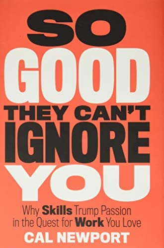

Ask not what your (career) can do for you, but what you can do for your (career) - JFK, mindly adapted.

Focus first on building up <em>rare and valuable skills</em> then trade those in for a great job.

---

# Exchange Skills for a Better Life

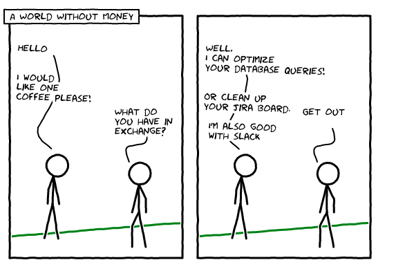

Comic by Greg Gzik

---

# Deliberate Practice

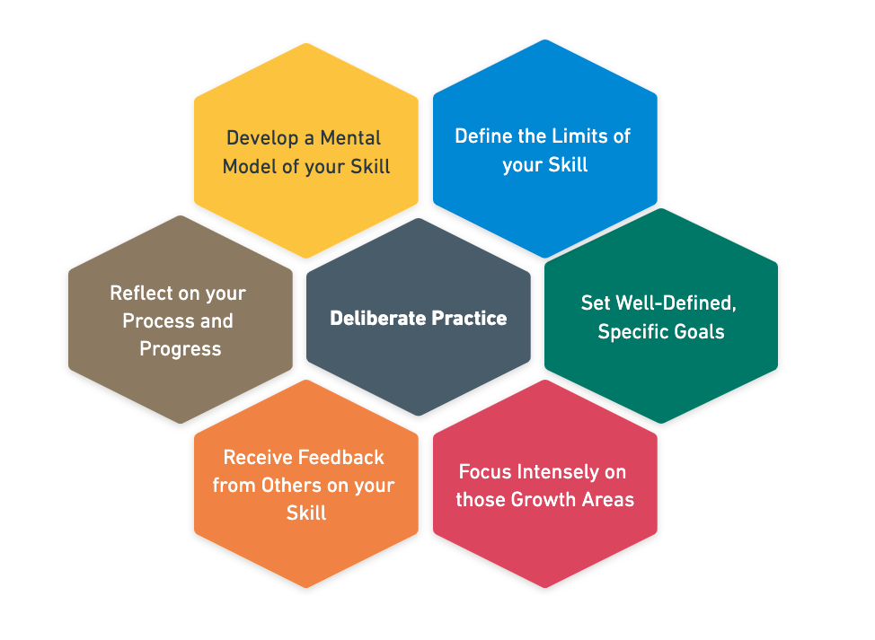

---

# Avoid the Amateur Plateau

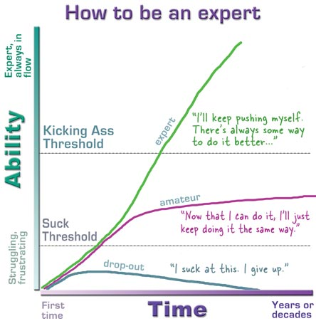

Graph by Kathy Sierra at the <a href="https://headrush.typepad.com/creating_passionate_users/2006/03/how_to_be_an_ex.html">Head Rush blog</a>

---

# The Feynmann Technique

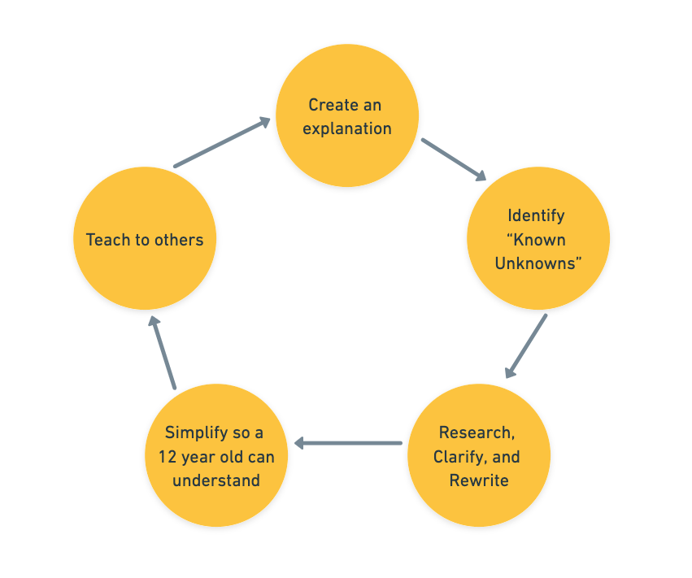

⚠️ Beware of misconceptions and unknown-unknowns

---

# Rule 4: Communication is Key

---

# How Does this 15 Minute History Video Draw us In?

<iframe width="600" height="350" src="https://www.youtube.com/embed/4WvKeYuwifc" title="YouTube video player" frameborder="0" allow="accelerometer; autoplay; clipboard-write; encrypted-media; gyroscope; picture-in-picture" allowfullscreen></iframe>

---

# Visual Anchors

- ❌ Point, Proof, Explain
- ✅ Visual Anchor + Context

Communication is about telling a good story - **show** people why they should care!

---

# Presenting Information

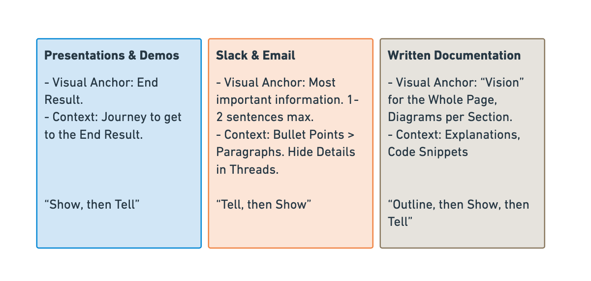

---

# One on One

> I never teach my pupils; I only attempt to provide the conditions in which they can learn – Albert Einstein

- If you are explaining something to someone else, have **them** drive the discussion based on their knowledge.
- If you the one having something explained to you, always **summarize** your understanding and ask questions before moving on to the next topic.

---

# Rule 5: Success is Inevitable

Cultivate an attitude of success within your team.

---

# Soft Skills for Software Engineers

  

    

  

  

    <ol>
      <li>Understand Yourself</li>
      <li>Choose your Company Carefully</li>
      <li>Hone a Craftsman Mindset</li>
      <li>Communication is Key</li>
      <li>Success is Inevitable</li>
    </ol>
    
Questions?

  

<a target="_blank">https://www.linkedin.com/in/gregory-gzik/</a>
